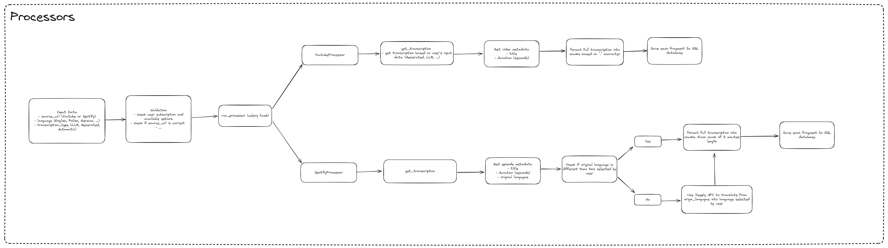
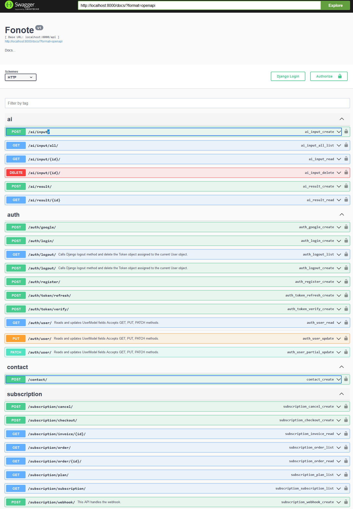
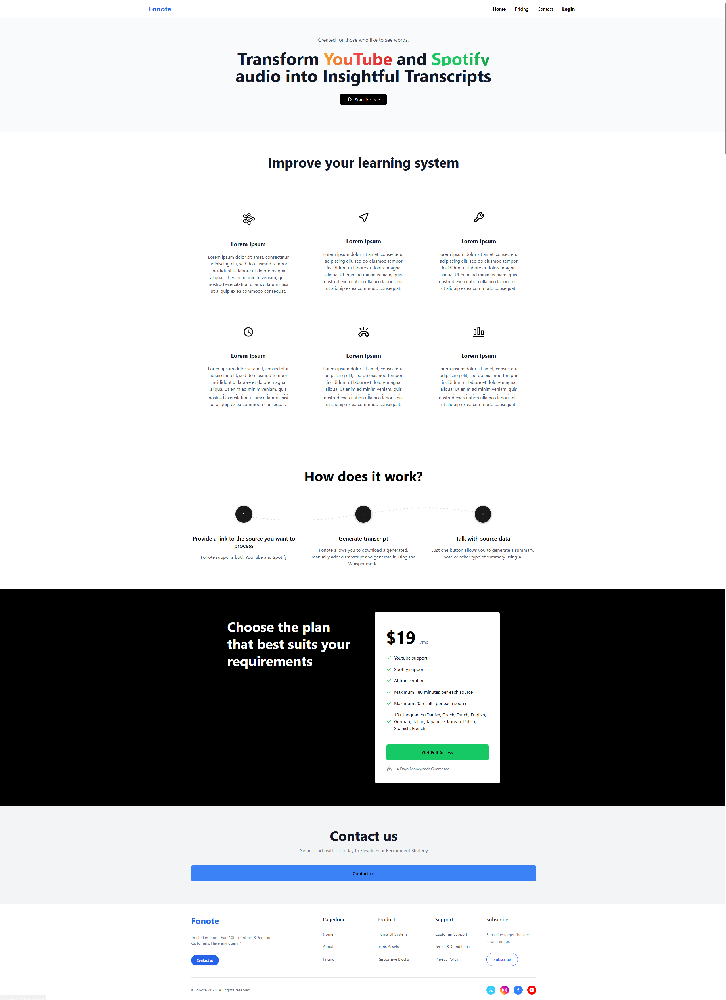
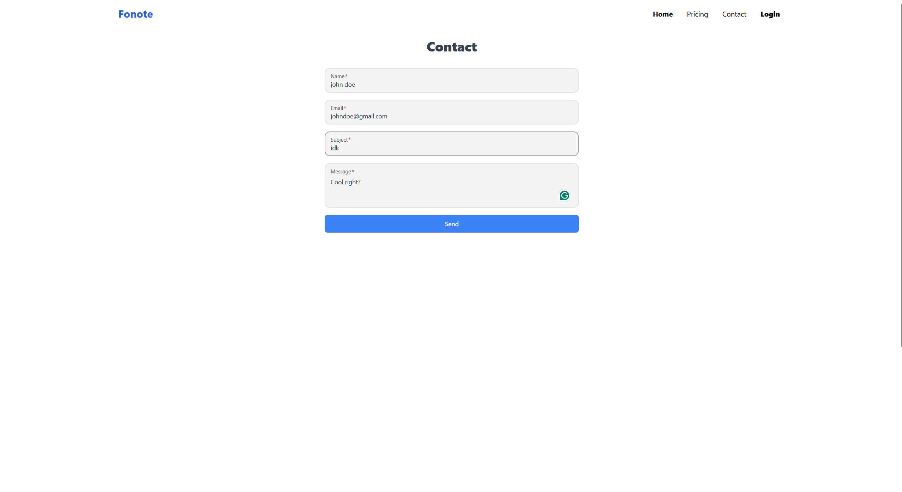
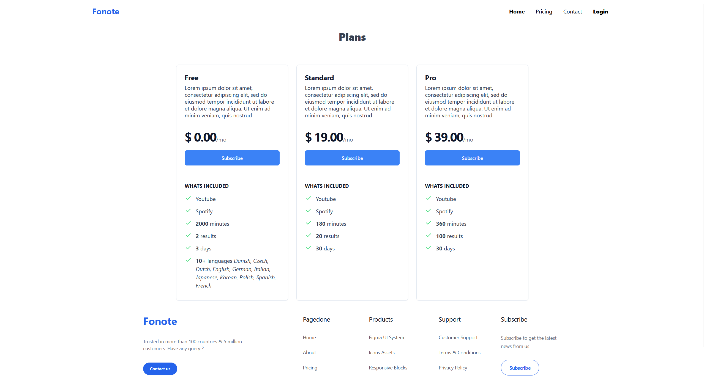
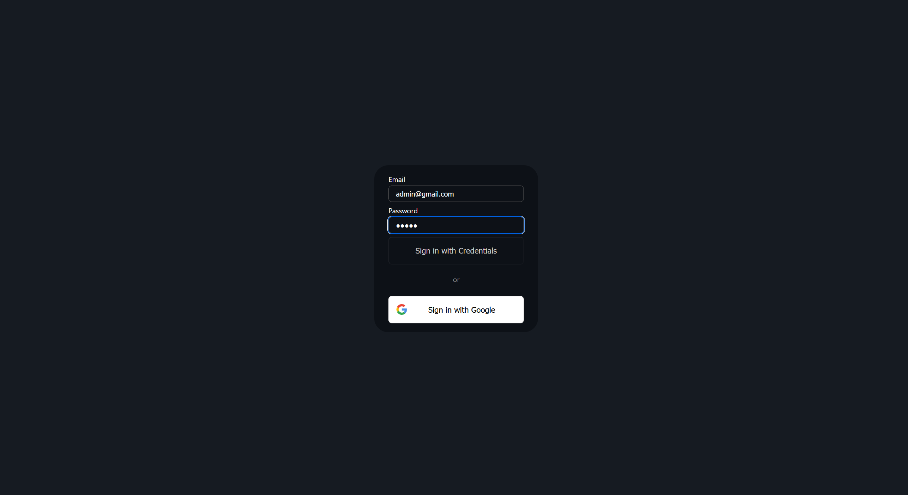
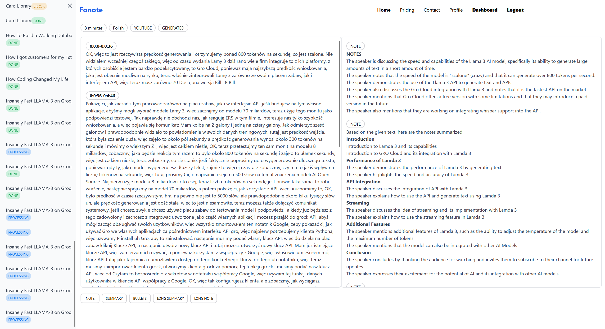
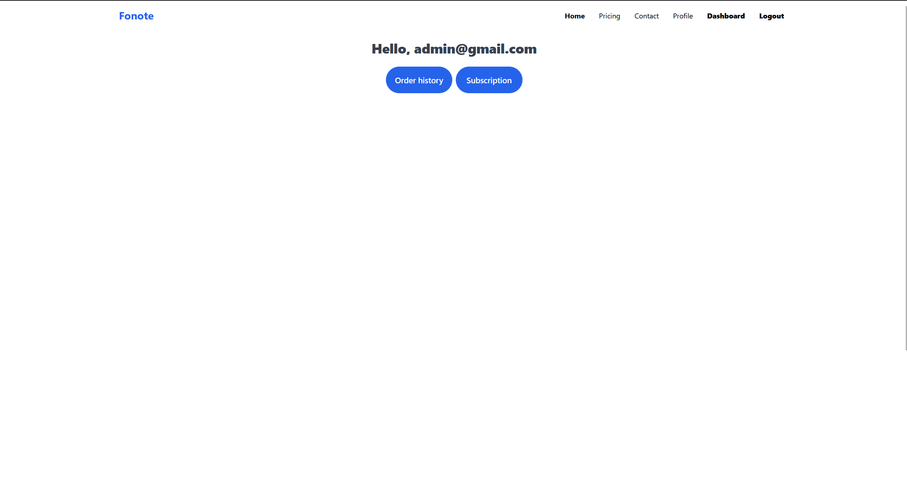
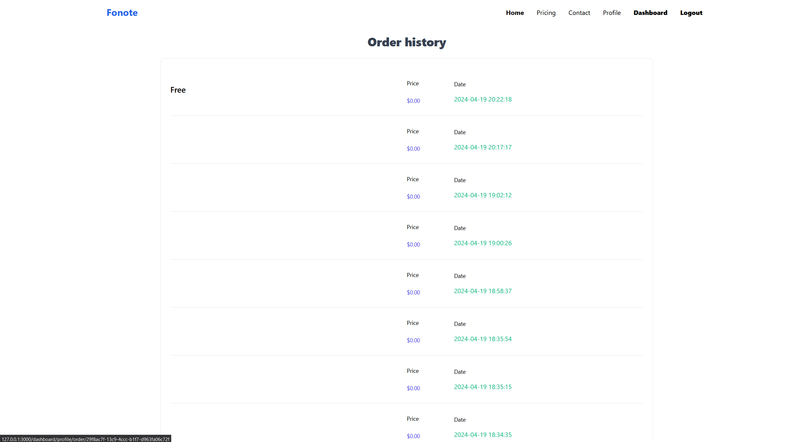

[![Contributors][contributors-shield]][contributors-url]
[![Forks][forks-shield]][forks-url]
[![Stargazers][stars-shield]][stars-url]
[![Issues][issues-shield]][issues-url]
[![MIT License][license-shield]][license-url]
[![LinkedIn][linkedin-shield]][linkedin-url]


<br />
<div align="center">
  <h3 align="center">Fonote</h3>

  <p align="center">
    Fonote allows you to generate transcriptions of materials from YouTube and Spotify and then create notes based on the received data
    <br />
    <br />
    <a href="https://github.com/DEENUU1/Fonote/issues">Report Bug</a>
    ·
    <a href="https://github.com/DEENUU1/Fonote/issues">Request Feature</a>
  </p>
</div>

## Processing




## Endpoints

 TODO

## Frontend





 
 
 

 
 

## Features

1. **Subscription Management using Stripe Service**:
   - Utilizes the Stripe API for handling subscription management.
   - Implements secure payment processing and recurring billing functionalities.

2. **YouTube Transcription Download**:
   - Implements a feature to fetch generated transcriptions from YouTube videos.

3. **YouTube Video Audio Processing using OpenAI's Whisper Model**:
   - Allows users to download any YouTube video and extract its audio content.
   - Utilizes OpenAI's Whisper model for converting audio into transcriptions.
   - Implements efficient audio processing techniques for large video files.

4. **Spotify Transcription Download**:
   - Provides functionality to fetch transcriptions generated from Spotify audio content.

5. **Transcription Translation using Deeply API**:
   - Integrates the Deeply API for translating transcriptions into different languages.

6. **Note Generation with Groq API (Llama 3 model)**:
   - Employs the Groq API, specifically the Llama 3 model, for generating various types of notes.
   - Utilizes natural language processing techniques to summarize, extract key points, and format notes.
   - Customizes note generation based on user preferences and input parameters.
   - Provides options for different note formats such as plain text, summary, bullet points, etc.

7. **OAuth2 Authentication with Google**:
   - Implements OAuth2 authentication flow for user authentication and authorization via Google.
        
## Technologies:
- Python
    - Django / Django Rest Framework
    - Celery
    - Pytest
- Typescript
    - React
    - Next.JS
- Docker / Docker compose
- SQLite
- PostgreSQL
- Redis
- CI/CD
- Stripe
- Whisper OpenAI
- Groq API

## Local environment installation

(backend)

```bash
# Clone repository
git clone https://github.com/DEENUU1/Fonote.git

# Create .env file 
cp .env_example .env

# Build image
docker-compose -f docker-compose.dev.yml build

# Run containers
docker-compose -f docker-compose.dev.yml up # -d 
```

(frontend)

```bash

# Change directory to ./frontend
cd ./frontend

# Create .env.local file
cp .env.local_example .env.local

# Run Next.js server
npm run dev
```

### Commands

#### Run pytest

```bash
# Inside backend container 

pytest 
```

#### Run Stripe webhook

To run stripe locally use this command to run a webhook

```bash
stripe listen --forward-to localhost:8000/api/subscription/webhook/
```

## Authors

- [@DEENUU1](https://www.github.com/DEENUU1)

<!-- LICENSE -->

## License

See `LICENSE.txt` for more information.


<!-- MARKDOWN LINKS & IMAGES -->
<!-- https://www.markdownguide.org/basic-syntax/#reference-style-links -->

[contributors-shield]: https://img.shields.io/github/contributors/DEENUU1/Fonote.svg?style=for-the-badge

[contributors-url]: https://github.com/DEENUU1/Fonote/graphs/contributors

[forks-shield]: https://img.shields.io/github/forks/DEENUU1/Fonote.svg?style=for-the-badge

[forks-url]: https://github.com/DEENUU1/Fonote/network/members

[stars-shield]: https://img.shields.io/github/stars/DEENUU1/Fonote.svg?style=for-the-badge

[stars-url]: https://github.com/DEENUU1/Fonote/stargazers

[issues-shield]: https://img.shields.io/github/issues/DEENUU1/Fonote.svg?style=for-the-badge

[issues-url]: https://github.com/DEENUU1/Fonote/issues

[license-shield]: https://img.shields.io/github/license/DEENUU1/fjob_backend.svg?style=for-the-badge

[license-url]: https://github.com/DEENUU1/Fonote/blob/master/LICENSE.txt

[linkedin-shield]: https://img.shields.io/badge/-LinkedIn-black.svg?style=for-the-badge&logo=linkedin&colorB=555

[linkedin-url]: https://linkedin.com/in/kacper-wlodarczyk

[basic]: https://github.com/DEENUU1/Fonote/blob/main/assets/v1_2/basic.gif?raw=true

[full]: https://github.com/DEENUU1/Fonote/blob/main/assets/v1_2/full.gif?raw=true

[search]: https://github.com/DEENUU1/Fonote/blob/main/assets/v1_2/search.gif?raw=true
