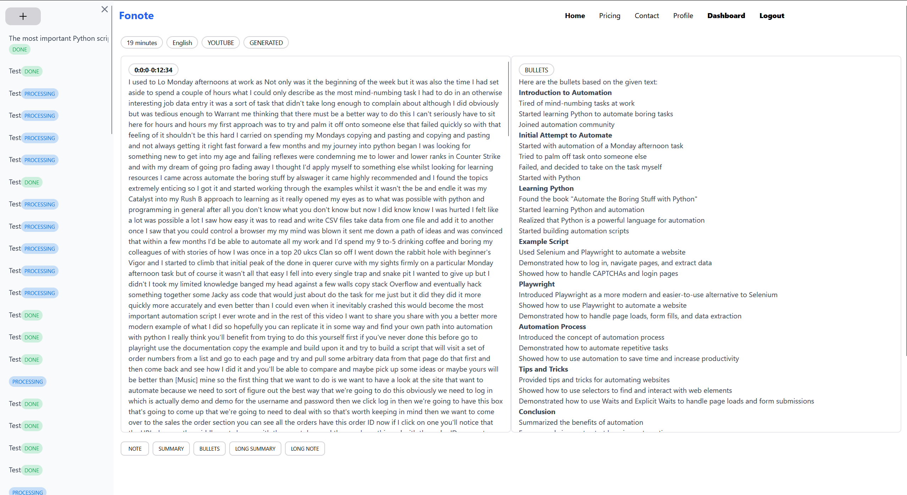
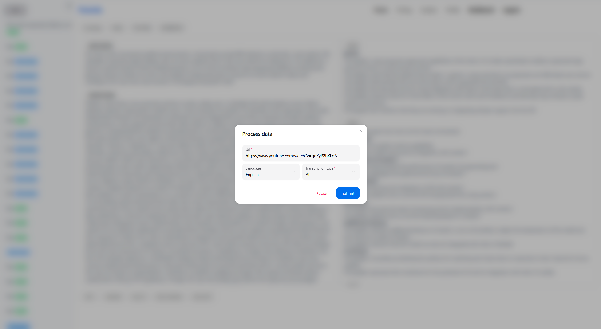

[![Contributors][contributors-shield]][contributors-url]
[![Forks][forks-shield]][forks-url]
[![Stargazers][stars-shield]][stars-url]
[![Issues][issues-shield]][issues-url]
[![MIT License][license-shield]][license-url]
[![LinkedIn][linkedin-shield]][linkedin-url]


<br />
<div align="center">
  <h3 align="center">Fonote</h3>

  <p align="center">
    ...
    <br />
    <br />
    <a href="https://github.com/DEENUU1/Fonote/issues">Report Bug</a>
    ·
    <a href="https://github.com/DEENUU1/Fonote/issues">Request Feature</a>
  </p>
</div>


## System Architecture
 TODO


## Endpoints
 TODO


## Frontend


 
 
 

 
 


## Features

1. ...
2. ...

## Technologies:
- Python
    - Django / Django Rest Framework
    - Celery
- Typescript
  - React
  - Next.JS
- Docker / Docker compose
- Redis
- CI/CD
- SQLite
- Stripe
- Whisper OpenAI
- Groq API


## Local environment installation

Backend in local mode use SQLite so there is no need to use Docker/Docker-compose

#### Without docker

(backend)
```bash
# Clone repository
git clone https://github.com/DEENUU1/Fonote.git

# Create .env file 
cp .env_example .env

# Install libraries
pip install -r requirements.txt

# Change directory to ./backend
cd ./backend

# Apply migrations
python manage.py migrate 

# Create super user 
python manage.py createsuperuser

# Run server 
python manage.py runserver 
```

(frontend)
```bash

# Change directory to ./frontend
cd ./frontend

# Create .env.local file
cp .env.local_example .env.local

# Run Next.js server
npm run dev
```


#### With docker

```bash
# Clone repository
git clone https://github.com/DEENUU1/Fonote.git

# Create .env file 
cp .env_example .env

# Build image
docker-compose build

# Run containers
docker-compose up # -d 

# Run server 
python manage.py runserver 
```

(frontend)
```bash

# Change directory to ./frontend
cd ./frontend

# Create .env.local file
cp .env.local_example .env.local

# Run Next.js server
npm run dev
```

#### Commands

Run pytest

```bash
pytest 
```

### Stripe 
To run stripe locally use this command to run a webhook
```bash
stripe listen --forward-to localhost:8000/api/subscription/webhook/
```


## Authors

- [@DEENUU1](https://www.github.com/DEENUU1)

<!-- LICENSE -->

## License

See `LICENSE.txt` for more information.


<!-- MARKDOWN LINKS & IMAGES -->
<!-- https://www.markdownguide.org/basic-syntax/#reference-style-links -->

[contributors-shield]: https://img.shields.io/github/contributors/DEENUU1/Fonote.svg?style=for-the-badge

[contributors-url]: https://github.com/DEENUU1/Fonote/graphs/contributors

[forks-shield]: https://img.shields.io/github/forks/DEENUU1/Fonote.svg?style=for-the-badge

[forks-url]: https://github.com/DEENUU1/Fonote/network/members

[stars-shield]: https://img.shields.io/github/stars/DEENUU1/Fonote.svg?style=for-the-badge

[stars-url]: https://github.com/DEENUU1/Fonote/stargazers

[issues-shield]: https://img.shields.io/github/issues/DEENUU1/Fonote.svg?style=for-the-badge

[issues-url]: https://github.com/DEENUU1/Fonote/issues

[license-shield]: https://img.shields.io/github/license/DEENUU1/fjob_backend.svg?style=for-the-badge

[license-url]: https://github.com/DEENUU1/Fonote/blob/master/LICENSE.txt

[linkedin-shield]: https://img.shields.io/badge/-LinkedIn-black.svg?style=for-the-badge&logo=linkedin&colorB=555

[linkedin-url]: https://linkedin.com/in/kacper-wlodarczyk

[basic]: https://github.com/DEENUU1/Fonote/blob/main/assets/v1_2/basic.gif?raw=true

[full]: https://github.com/DEENUU1/Fonote/blob/main/assets/v1_2/full.gif?raw=true

[search]: https://github.com/DEENUU1/Fonote/blob/main/assets/v1_2/search.gif?raw=true
